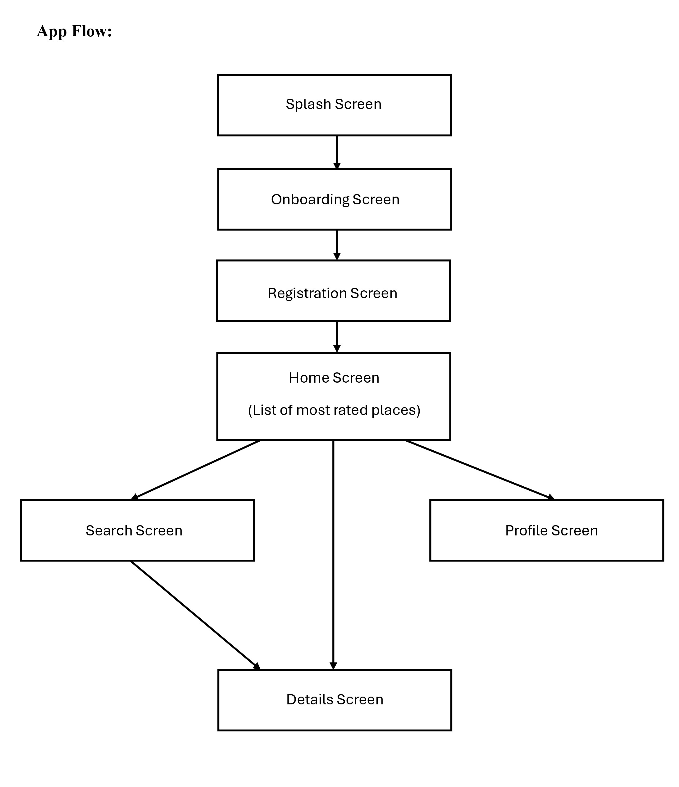
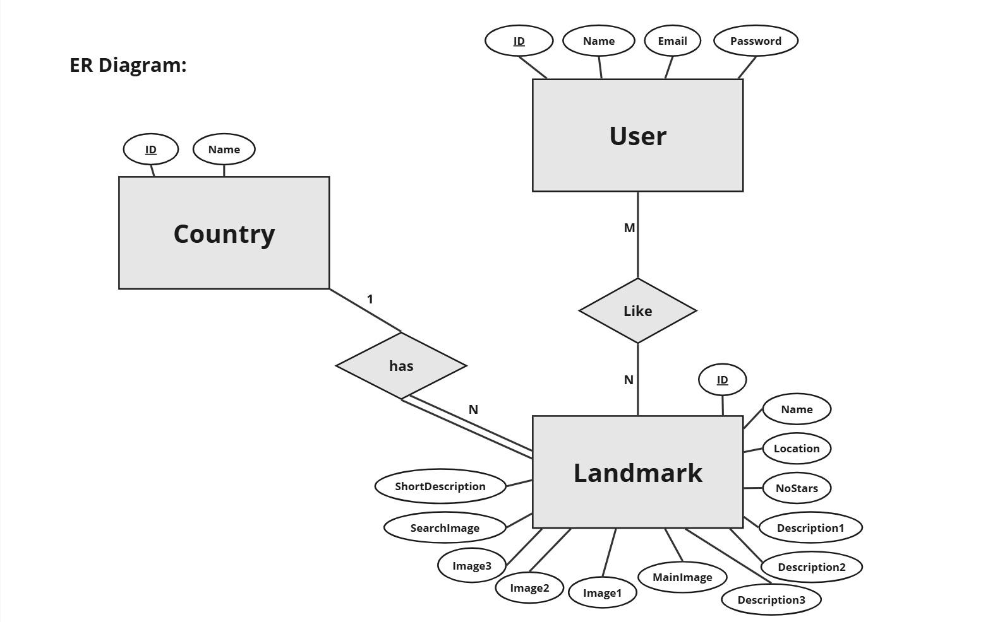
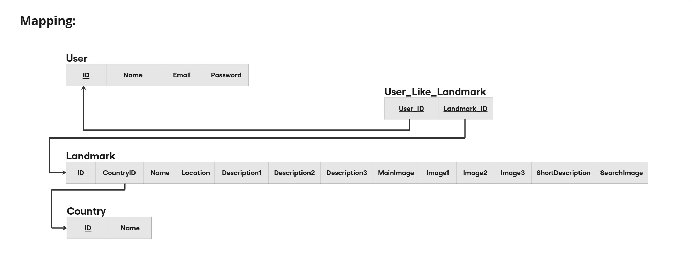

# World Landmarks (Tourism App)
## Brief Project Description
World Landmarks is an Android mobile application built with Android Studio. The app allows users to explore famous and beautiful places around the world through images and short descriptions.

## Target Users
- Travelers
- Anyone interested in cultures and places.

## Built With
- Android Studio
- Java
- XML
- SQLite Database

## App Flow

## Components Used
The project contains the following 7 activities:
- Splash Activity
- Onboarding Activity
- Registration Activity
- Main Activity
- Details Activity
- Search Activity
- Profile Activity

Also the following components were used:
- LinearLayout
- ScrollView
- CardView
- RecyclerView
- BottomNavigationView
- Menu
- Spinner
- AutoCompleteTextView
- CheckBox
- ImageButton
- ImageView
- Button
- EditText
- TextView

## Features 
### Registration Page
The app allows users to sign up using their email address. It includes features such as validating user input and ensuring that each email address is linked to only one account. This helps maintain data consistency.

### Explore Top Rated Places on Home Page
The home page displays the top 5 highest-rated places in the app, allowing users to quickly discover popular destinations.

### Search for Places by Name or Country
The app allows users to search for places by their name or by the country by selecting it from a drop-down list, making it easier to find a specific destination.

### Details Page 
Users can view detailed information on the details page of each place, which includes the place title, images, location and a short description. They can also rate the place by marking it with a star, which increases its overall rating.

### Profile Page
This page allows users to manage their account. It displays their name and the email address linked to their account. Users can also update their information, delete their account, or log out.

### Bottom Navigation
The app contains a bottom navigation bar that allows users to switch between the Home, Search, and Profile pages.

## Database Structure
This app uses SQLite Database from Android Studio.
The mapping resulted in 4 database tables:
- User
- Country
- Landmark
- User_Like_Landmark (Many-to-Many)

## ER Diagram

## Mapping

## Screenshots and Demo
This repository includes screenshots and a demo of the World Landmarks Mobile Application.

## How to Run the App
1. Download or clone the repository.
2. Open the project folder using Android Studio.
3. Run the application on a virtual or remote device.

## Authors
- [Ibrahim Rajou](https://github.com/IbrahimRajou)
- [Mahmoud Youssuf](https://github.com/MahmoudYoussuf)
